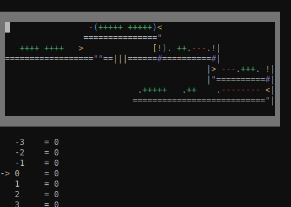

# MarioLANG

A MarioLANG Interpretor made in C++.



To learn more about this language, [here](https://esolangs.org/wiki/MarioLANG) is the wiki.

## Usage

```bash
make
./MarioLANG [FILE] [-a|--animate] [-d <time>]
```

- **FILE**: a text file containing MarioLANG code.
- **-a**: display the code while being interpreted, and the memory tape. Disabled by default.
- **-d \<time\>**: wait \<time\> milliseconds before evaluating next step. Only works when **-a** is activated. Default value is `100`.

## Install

```bash
sudo make install # Installation might require root permission
mariolang [FILE] [-a|--animate] [-d <time>]
```

## Files

The `src/` directory contains the source code of the interpreter.

In the `tests/` directory, you can find `.mlg` files, which are sample codes in MarioLANG. The expected output of each file is located in `tests/out/`.